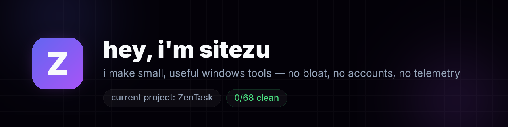

  

&nbsp;
&nbsp;

**current project — [ZenTask](https://github.com/sitezu/Zentask)** 🟣 
a tiny always-on-top macro recorder & auto clicker for windows. 
*record it once. it does it forever.*

[**⬇ download**](https://github.com/sitezu/Zentask/releases/latest/download/ZenTask-Setup-1.0.6.exe) · [🌐 website](https://sitezu.github.io/Zentask/) · [📦 all releases](https://github.com/sitezu/Zentask/releases)

free, open releases, MIT. if something breaks, tell me and i'll fix it fast.

